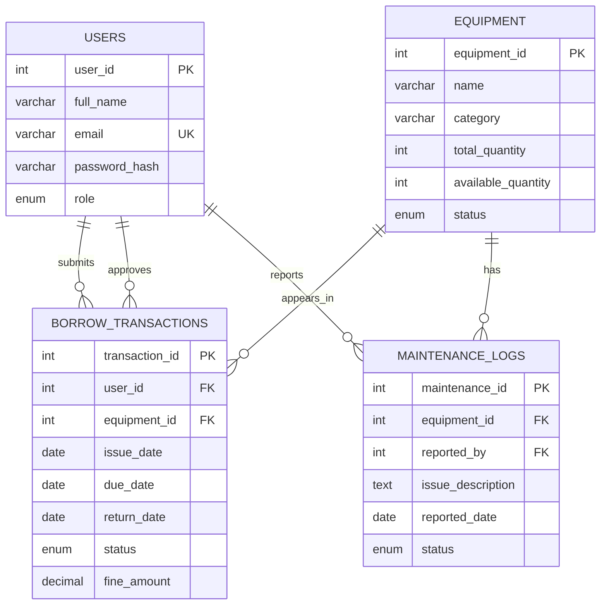

# CLMS Task Guide

## 1. Project goal

Build a role-based College Laboratory Equipment Management System. Students can find equipment and submit borrowing requests. Lab assistants and administrators manage inventory, approve requests, process returns, and record maintenance.

## 2. Delivery milestones

### Phase 1: UI and database design
**Due: September 22, 2026**

- [x] Define users, equipment, transactions, and maintenance entities
- [x] Create the ER model and SQL schema
- [x] Build the responsive frontend prototype
- [x] Add client-side form validation and interactive request flow
- [ ] Review screens with the full team
- [ ] Attach screenshots and ER diagram export to the assessment submission

### Phase 2: Java backend and database integration
**Due: October 5, 2026**

- [ ] Create Java model classes
- [ ] Add validation and domain exceptions
- [ ] Implement service classes
- [ ] Implement DAO classes with JDBC
- [ ] Connect authentication to the users table
- [ ] Replace frontend demo data with backend responses
- [ ] Test issue, return, overdue, and maintenance workflows

## 3. User stories

### Student
- I can sign in as a student.
- I can search equipment and see availability.
- I can request available equipment with a return date.
- I can see my request status and fine amount.

### Lab assistant or administrator
- I can view inventory and availability.
- I can approve or reject pending requests.
- I can mark equipment as returned.
- I can record equipment maintenance.

## 4. Database relationship model

## 5. Team task guide

| Area | Owner | Phase 1 output | Phase 2 output |
|---|---|---|---|
| UI and UX | Shreyash | Dashboard, catalog, forms | Frontend/backend integration |
| Database | Aniruddha | ER model, schema, sample data | JDBC queries and constraints |
| Java backend | Dishita | Domain rules documented | Models, services, exceptions |
| Testing and documentation | Sakshi | User stories, validation checklist | Test cases, screenshots, final report |

The team should review ownership together before submission and use feature branches such as `feature/frontend`, `feature/database`, and `feature/backend`.

## 6. Business rules

- Only equipment with `available_quantity > 0` can be requested.
- A due date must be after the issue date.
- A returned item increases available quantity by one.
- A late return fine is calculated as `late_days * 10`.
- Equipment under maintenance cannot be issued.
- Only lab assistants and administrators can approve requests or manage maintenance records.

## 7. Phase 1 acceptance checklist

- [ ] Login/role selection is visible and understandable.
- [ ] Equipment cards show category, location, status, and quantity.
- [ ] Search and category filtering work.
- [ ] Request modal rejects missing or invalid dates.
- [ ] Successful requests appear in the activity table.
- [ ] SQL executes in the selected MySQL or PostgreSQL environment after minor dialect adjustments.
- [ ] ER model, screenshots, and task allocation are included in the submission.
